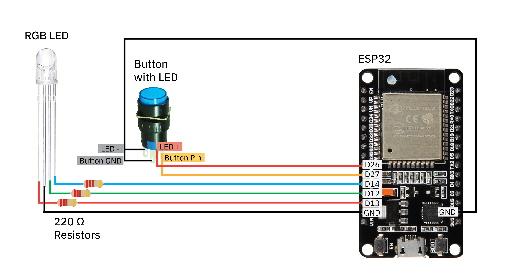

# DIY Love Messenger
By Julia Daser and Pepi Ng

Demo of Love Messengers working:
 
 

## About 
Our DIY Love Messengers are the perfect gift for your friends/ partners, especially long-distance ones! When the button of one love messenger is pressed, both of them will light up - no matter HOW FAR AWAY the two messengers are! All files, code and 3D models can be found in this repository.

We also documented this in a [tutorial](https://www.youtube.com/watch?v=Ot5ihNqtx74&feature=youtu.be&ab_channel=WormiCollective)

We are using the ESP32 microcontrollers for this tutorial. We also created a previous tutorial on [How to send data between many ESP32s from anywhere in the world](https://www.youtube.com/watch?v=Xx5cEIbBvZY&ab_channel=WormiCollective).

### Materials needed for TWO Love Messengers
1. Some translucent filament for the heart. We used [this from Elegoo](https://www.elegoo.com/products/elegoo-pla-filament-1-75mm-3d-printer-filament-1kg-spool-2-2-lbs?currency=USD&variant=41070433435696&utm_medium=cpc&utm_source=google&utm_campaign=Google%20Shopping&stkn=0ecb254324d1&gad_source=1&gclid=CjwKCAiAzJOtBhALEiwAtwj8ts-R_T5OdutASB50cKdbf90s-47HiCjKZybQpqPGfl86xcRwGrMpqBoCVn8QAvD_BwE) 
2. Some filament of your choice, for the casing.
3. [2 ESP32-WROOM-32 microcontrollers](https://www.getfpv.com/esp32-development-board-w-wifi-bluetooth.html?utm_source=google&utm_medium=cpc&utm_campaign=DM+-+NB+-+PMax+-+Shop+-+No-index+-+SM+-+ALL+%7C+Full+Funnel&utm_content=pmax_x&utm_keyword=&utm_matchtype=&campaign_id=20799936859&network=x&device=c&gc_id=20799936859&gad_source=1&gclid=CjwKCAiAzJOtBhALEiwAtwj8ttuekYgUBbMJGP-JRPyLEPyVTKI_yBnxqm1hygJcPFpiuKzBD8us1hoCmlAQAvD_BwE) ($6.99 per)
4. [2 Adafruit 16mm illuminated push buttons](https://www.adafruit.com/product/1478) ($1.95 per)
5. Some wires
6. [Some heat shrink tubes](https://www.adafruit.com/product/1649) ($4.95 per)
7. [Two RGB LEDs](https://www.adafruit.com/product/159) ($2.00 per) 
8. [2 Micro-USB wires used to power and to transmit data](https://www.bestbuy.com/site/best-buy-essentials-3-usb-a-to-micro-usb-charge-and-sync-cable-black/6456436.p?skuId=6456436&utm_source=feed&ref=212&loc=20161460807&gad_source=1&gclid=CjwKCAiAzJOtBhALEiwAtwj8thVSNr45dY5C1Sd8EiPBhqMn8sO--0ueCs4qPVapoc-a6hkdDCGhWRoCYbwQAvD_BwE&gclsrc=aw.ds) ($4.99 per)
9. [8x M2-0.4 x 10 mm Screws](https://www.homedepot.com/p/Prime-Line-M2-0-4-x-10-mm-Grade-A2-70-Metric-Stainless-Steel-Phillips-Drive-Pan-Head-Machine-Screws-10-Pack-9130681/311229806) ($4.69 for a pack of 10)
10. [6x 220ohm Resistors](https://www.adafruit.com/product/2780) ($0.75 for pack of 25)

### Equipment needed
1. 3D printer
2. Pliers
3. Wire Stripper
4. Small Screwdriver
5. Soldering Kit
6. Solder Sucker
7. Heat Gun / Rework station

## Process
The tutorial includes 3D printing, setting up a real-time database (we used [Firebase](https://firebase.google.com/)), uploading some arduino code and assembling everything together! 

Everything is documented in our YouTube Video. Here's the wiring diagram we used: 
 
 
 

## Contact us
We hope you guys had tons of fun building these DIY Love Messengers as much as we did!  If you have any questions/ feedback, do reach us at yiqing.ng@gmail.com.

